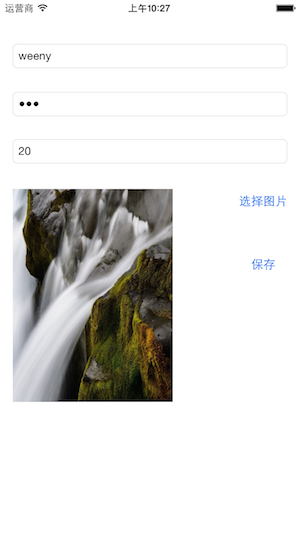

### 说明

这是一个使用NSUserDefault来保存用户数据的列子。

### 使用到的知识点

* NSUserDefault
* UIImagePickerController

### 参考文章

* [OS SDK: Working with NSUserDefaults](http://code.tutsplus.com/tutorials/ios-sdk-working-with-nsuserdefaults--mobile-6039)
